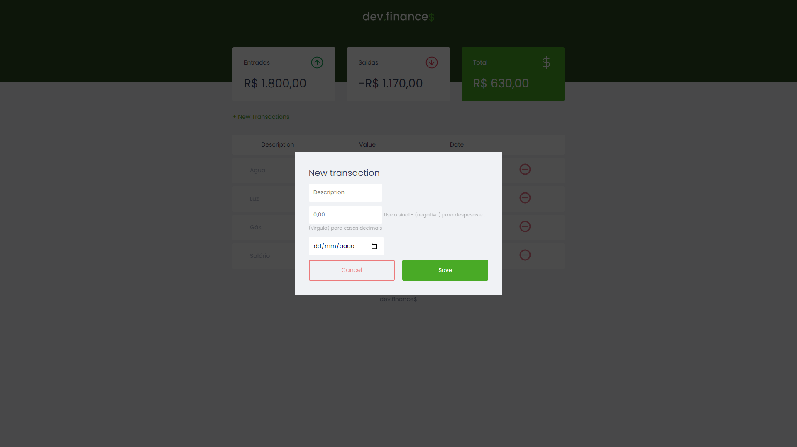

<h1 align="center">Finance Maratona Discover 🚀</h1>

<div align="center">

[](/LICENSE)

</div>

---

## 💻 About

O dev.finance$ é uma aplicação de controle de finanças. Este é um projeto desenvolvido durante a Maratona Discover, realizada pela **[@Rocketseat](https://github.com/Rocketseat)** e ministradas pelo **[Mayk Brito](https://github.com/maykbrito)** durante os dias 14, 21, 28 de janeiro e 04 de fevereiro.

## 🚀 Starting

To start the project, just open the file ```index.html``` in your preferred browser.

## 🛠️ Built Using <a name = "built_using"></a>

- HTML
- CSS
- JavaScript

## 🥳 Authors 

- Made by [@lucasarlim](https://github.com/lucasarlim)

## 📸 Screenshots



